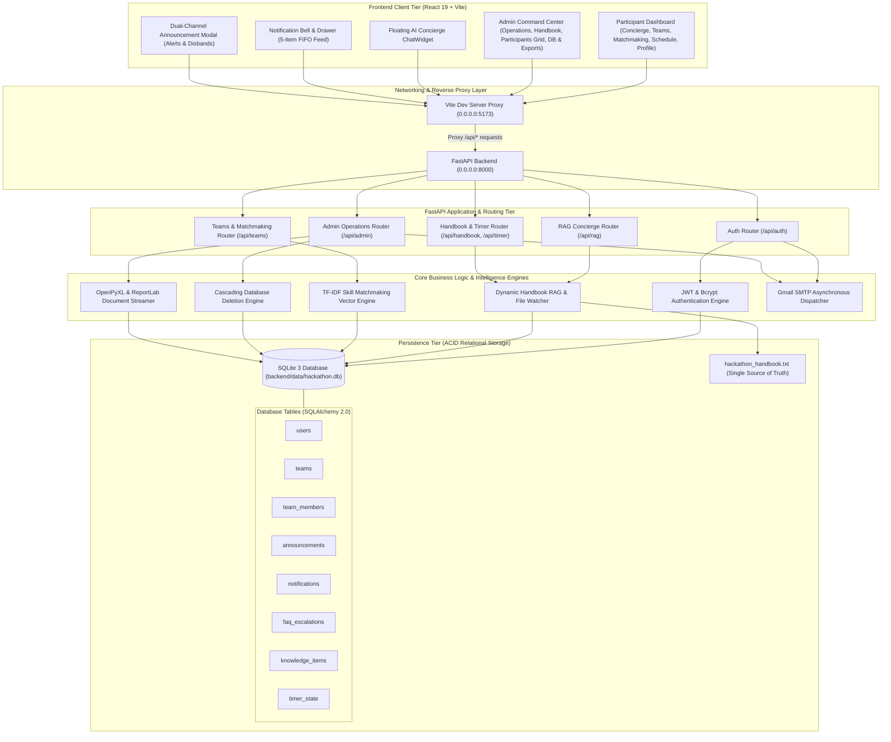
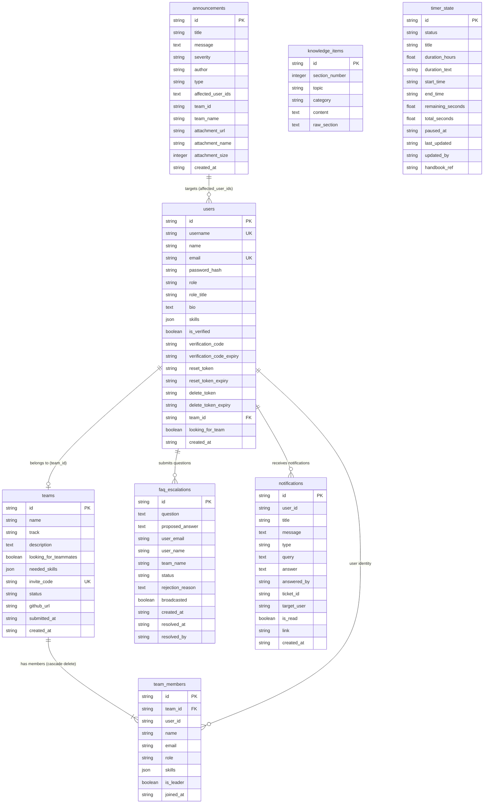
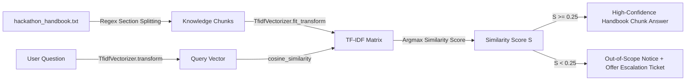
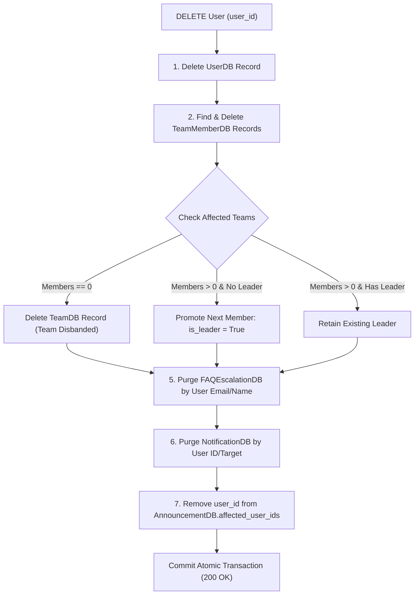

# Hackathon Operations & AI Matchmaking Platform (Hackathon 2026)
# Comprehensive Product Requirements Document (PRD) & Technical Reference Manual

---

## 1. Executive Summary & System Vision

### 1.1 Product Overview
The **Hackathon Operations & AI Matchmaking Platform** is an enterprise-grade, real-time operating system engineered to manage continuous, high-intensity hackathons (such as 36-hour and 48-hour sprints). It unifies participant self-service, intelligent skill-based team matchmaking, grounded AI knowledge retrieval (RAG Concierge), project submission tracking, and organizer command control into a single cohesive platform.

### 1.2 Core Problem Statement & Solutions
| Hackathon Challenge | Traditional Problem | Platform Solution |
| :--- | :--- | :--- |
| **Participant Inquiries** | Organizers overwhelmed by hundreds of repetitive questions (Wi-Fi, meal timings, judging rules). | **Grounded RAG Concierge**: Instant natural language Q&A strictly grounded in the live event handbook, with an explicit escalation workflow to human organizers for out-of-scope inquiries. |
| **Team Formation** | Solo developers struggle to find compatible teammates matching their tech stack. | **TF-IDF Vector Matchmaking**: Algorithmic cosine similarity pairing based on complementary skill tags (e.g. React, Python, PyTorch, Solidity) and hackathon track themes. |
| **Live Rule Changes** | Updates to Wi-Fi passwords, schedules, or tracks require manual website redeployments. | **Live Handbook Hot-Sync**: In-browser markdown/text handbook editor immediately re-indexes knowledge chunks, Quick Reference cards, and track selectors across all client views within 3 seconds. |
| **Emergency Alerts** | Slack/Discord messages get lost in high-volume chat streams. | **Dual-Channel Broadcast**: In-app modal popups with severity tiers (`info`, `warning`, `critical`), file attachments, and asynchronous SMTP email dispatch to all registered participant inboxes. |
| **Multi-Device Local Access** | Deploying online frequently suffers from environment, CORS, or proxy mismatches. | **Single-Port Reverse Proxy (`0.0.0.0`)**: Vite dev server proxies API calls directly to Uvicorn, allowing any smartphone or laptop on the local Wi-Fi hotspot (`192.168.137.1:5173`) to seamlessly access the full platform. |
| **Data Hygiene & Cleanup** | Deleting users leaves orphaned records across team rosters, tickets, and notifications. | **Instant Full-Database Cascade Deletion**: Single-click and batch purging across `users`, `team_members`, `teams`, `faq_escalations`, and `notifications` with automated team disbanding and leadership reassignment. |
| **Post-Event Reporting** | Organizers spend hours manually compiling team rosters, submissions, and telemetry into spreadsheets. | **1-Click Multi-Format Export**: Generates professional multi-sheet Excel workbooks (`.xlsx`) via `openpyxl` and print-ready PDF executive summaries via `ReportLab`. |

### 1.3 Target Personas
1. **Hackathon Participants / Developers**: Solo hackers and teams seeking instant event answers, teammate matchmaking, team roster management, GitHub submission linking, real-time announcements, and live sprint countdown tracking.
2. **Event Organizers / Administrators**: Operations leads who broadcast alerts, resolve participant ticket escalations, edit live event rules, manage team rosters, monitor SQLite database telemetry, export reports, and purge invalid records.
3. **Mentors & Judges**: Technical advisors monitoring participant inquiries, tracks, GitHub repositories, and submission statuses.

---

## 2. Technology Stack & Architecture Matrix

### 2.1 Technology Stack Breakdown

| Layer | Technologies Used | Purpose & Architectural Rationale |
| :--- | :--- | :--- |
| **Backend Framework** | **Python 3.14 / 3.10+**, **FastAPI**, **Uvicorn (ASGI)** | High-performance asynchronous REST API, auto-generated OpenAPI documentation, fast execution, dependency injection. |
| **Database & ORM** | **SQLite 3**, **SQLAlchemy 2.0**, `scoped_session` | Server-local ACID relational persistence (`backend/data/hackathon.db`) with thread-safe session scoping, foreign key cascades, and dual JSON sync. |
| **Frontend Framework** | **React 19**, **Vite 8** | High-performance Single Page Application (SPA), fast Virtual DOM reconciliation, Hot Module Replacement (HMR). |
| **Styling & Design System** | **Vanilla CSS (Design Tokens & Glassmorphism)** | Bespoke dark-mode aesthetic (`#090d16`, `#0f172a`, `#6366f1`, `#ec4899`, `#06b6d4`, `#10b981`), backdrop-filter blur effects, smooth micro-animations, no CSS library bloat. |
| **Icons & Visuals** | **Lucide React** | Scalable, clean iconography across navigation, stats cards, modals, and status badges. |
| **AI / NLP & RAG Engine** | **Scikit-Learn (TF-IDF & Cosine Similarity)**, **Multi-Tier LLMs (Groq Llama 3.3, OpenAI GPT-4o-mini, Google Gemini)** | Multi-tier architecture: In-memory vector cosine retrieval for deterministic handbook answers with fallback to cloud LLM generative synthesis when API keys are configured. |
| **Document & Report Generation** | **`openpyxl` 3.1+**, **`reportlab` 4.0+** | Multi-sheet formatted Excel workbook generation and vector PDF document compilation streamed in-memory via `io.BytesIO`. |
| **Authentication & Security** | **`pyjwt` 2.8+**, **`bcrypt` 4.1+**, **Pydantic v2**, **`email-validator`** | JWT stateless Bearer tokens (HS256), cryptographic salt hashing, strict schema validation, OTP verification. |
| **Email Service** | **Python `smtplib`**, **`email.mime`**, **Gmail SMTP SSL/TLS** | Asynchronous email dispatch for 6-digit OTP verification, password resets, and critical emergency broadcasts. |
| **Networking & Reverse Proxy** | **Vite Dev Server Proxy (`0.0.0.0:5173`)** | Single-port routing for multi-device Wi-Fi/Hotspot access without CORS issues or port exposure. |

---

### 2.2 System Architecture Diagram



---

### 2.3 Network Topology & Multi-Device Local Hotspot Access

To enable **any laptop or mobile phone** on a local network or Windows Mobile Hotspot (`192.168.137.1`) to access the entire application smoothly:

1. **Vite Reverse Proxy Binding**:
   - `frontend/vite.config.js` is configured with `host: '0.0.0.0'` and `port: 5173`.
   - All client API calls are relative (`/api/...`), routed through Vite's built-in reverse proxy targeting `http://127.0.0.1:8000`.
2. **FastAPI Uvicorn Binding**:
   - Uvicorn runs on `--host 0.0.0.0 --port 8000`.
3. **Cross-Device URL**:
   - Any device connected to the host's Wi-Fi hotspot navigates to:
     ```
     http://192.168.137.1:5173
     ```
   - **Why this works**: Clients only communicate with port `5173`. No secondary ports need to be opened, eliminating CORS preflight failures and mobile firewall blocks.

---

## 3. Database Architecture & Data Models (SQLite 3 + SQLAlchemy 2.0)

### 3.1 Relational Entity-Relationship (ER) Diagram



### 3.2 Thread Safety & Concurrency (`db_session_scope`)
To prevent SQLite `database is locked` race conditions and resource leaks across async FastAPI coroutines:
- **`scoped_session`**: SQLAlchemy's thread-local session factory binds database transactions to the active execution thread.
- **Context Manager (`db_session_scope()`)**:
  ```python
  @contextmanager
  def db_session_scope():
      session = SessionLocal()
      try:
          yield session
          session.commit()
      except Exception:
          session.rollback()
          raise
      finally:
          session.close()
  ```
  Every request guarantees atomic commits on success, rollbacks on failure, and deterministic connection closing.

---

## 4. Participant Dashboard & User Experience (Feature Specifications)

### 4.1 Grounded AI Concierge & Q&A Assistant
- **Live Handbook Grounding**: Chatbot answers questions by vector-retrieving matching sections from `hackathon_handbook.txt`.
- **Confidence Thresholding**: If similarity score $< 0.25$ or out-of-scope, the Concierge admits it does not know and offers an explicit **"Escalate Question to Organizers"** button.
- **Instant Quick-Answer Chips**: Wi-Fi, Meal Timings, Rules, Judging Rubrics, Tracks.
- **Floating Chat Widget**: Persistent across all pages with history preservation.

### 4.2 Team Formation, Invite Codes & Track Selection
- **Create Team**: Leaders specify Team Name, Hackathon Track (dynamically loaded from Section 3 of handbook), Description, and Needed Skills.
- **Invite Codes**: System generates a unique 6-character code (e.g., `A9F0E1`).
- **Join Team**: Enter invite code with instant roster assignment (enforces 2 to 4 member limits).
- **Manage Roster**: View teammate bios, skills, and leader badge (`👑`).

### 4.3 AI Skill-Based Matchmaking Engine
- **Vector Space Representation**: Converts skills arrays (e.g. `["React", "Python", "PyTorch"]`) into TF-IDF vectors.
- **Cosine Similarity Ranking**: Computes compatibility percentage ($0\% - 100\%$) between the current user's profile and candidate solo hackers.
- **Matchmaking Directory**: Filter candidates by track interest, skill tags, or availability.

### 4.4 Project Submission Portal & GitHub Repository Linking
- **GitHub Repository Input**: Team leader submits GitHub repo URL (`https://github.com/org/repo`).
- **Live Verification**: Regex validates GitHub repository syntax.
- **Submission Lock**: Sets team status to `submitted`, records ISO timestamp, and shows a green verified submission badge.

### 4.5 Live 48-Hour Hackathon Countdown Banner
- Synchronized countdown calculated dynamically against the master timer end time:
  $$\text{diffSec} = \max\left(0, \left\lfloor \frac{\text{endTimeMs} - \text{nowMs}}{1000} \right\rfloor\right)$$
- Displays formatted string: `2d : 00h : 00m : 00s` or `47h : 59m : 50s`.

### 4.6 Dynamic Event Schedule & Quick Reference Card
- Dynamically parses `hackathon_handbook.txt`:
  - **Wi-Fi**: SSID and Password.
  - **Judging Rubric**: Innovation (30%), Technical Execution (30%), UX (20%), Impact (20%).
  - **Catering**: Breakfast, Lunch, Dinner, Snacks timetable.
  - **Venue**: GIETU CSE Block.

### 4.7 Notification Bell & Emergency Broadcast Modals
- **Notification Drawer**: Navbar bell displaying top 5 answered Q&A responses and event updates with unread count badges.
- **Emergency Broadcast Popups**: High-priority broadcasts appear in a modal with severity glow (blue info, yellow warning, red critical) and downloadable file attachments.

### 4.8 Profile Management & Skills Cloud
- Edit Display Name, Username, Role Title (e.g. "AI/ML Engineer"), Bio, and select from 30+ interactive skill pills.
- Account status indicator (Verified vs Unverified).

### 4.9 Secure Authentication, 6-Digit Email OTP & Password Recovery
- **Registration**: Form with live visual Password Strength Meter.
- **Email Verification**: 6-digit numeric OTP sent via Gmail SMTP.
- **Forgot Password**: OTP-based password reset without old credentials.
- **Self-Service GDPR Account Deletion**: 2-step OTP verified deletion.

---

## 5. Admin & Organizer Mission Control (Feature Specifications)

### 5.1 Operations Command Center & 48-Hour Live Timer Controls
- **Live Master Sprint Timer**: Start, Pause, Resume, Reset, and Sync from Handbook.
- **Live Metrics Counter**: Real-time cards displaying Total Users, Active Teams, Submissions, and Pending Support Inquiries.

### 5.2 Emergency Broadcast Center
- Compose broadcasts with title, body, and severity (`info`, `warning`, `critical`).
- **File Attachments**: Upload PDFs, ZIP archives, or images with secure size and type validation.
- **Asynchronous SMTP Email Blast**: Dispatches responsive HTML alert emails to all registered participant addresses in the background.

### 5.3 Q&A Support Escalation Queue
- View participant support tickets filtered by `pending`, `resolved`, `rejected`.
- **Answer & Push**: Type an official organizer response; automatically pushes to the participant's Notification Bell drawer.
- **Reject with Reason**: Mark duplicate or out-of-scope questions with customized notes.
- **Batch Deletion**: Select multiple tickets and delete in bulk.

### 5.4 Team Rosters & Live Submission Tracker
- **Toggle View**: High-density List View vs Panoramic Grid View.
- **Status Badges**: `Submitted` (green with GitHub link), `Not Submitted` (amber), `Disqualified` (red).
- **Disqualify / Reinstate**: One-click status toggle.
- **Auto-Disqualify at Deadline**: One-click action to disqualify all unsubmitted teams when the sprint timer expires.

### 5.5 Live Handbook & Knowledge Base Editor
- Monospaced code editor displaying `hackathon_handbook.txt`.
- **`💾 Save & Push Changes`**: Atomically updates file on disk and hot-reloads the RAG vector index, Quick Reference cards, and dynamic tracks list in real time without server restart.

### 5.6 Registered Participants Directory (Panoramic Grid Explorer)
- **Top KPI Cards**: Total Registered, Assigned to Team, Solo / Seeking Team, Verified Accounts.
- **Instant Search**: Search across Name, `@username`, Email, Role Title, Bio, Team Name, and Skills tags in real time.
- **Filter Pills**: `All`, `In Team`, `Solo Hackers`, `Verified`, `Admins`.
- **Glassmorphic Grid Cards**: Avatar with initials, badges, bio quote, team pill with leader crown (`👑`), skill pills, and registration date.
- **Multi-Select Batch Action Bar**: Checkbox selection with "Select All Filtered" and floating red **"Purge Selected (N) & All Records"** action bar.

### 5.7 Instant Full-Database Cascade Deletion Engine
- **Single User Deletion (`DELETE /api/admin/users/{user_id}`)**:
  - Permanently purges user from `users` table.
  - Removes user from `team_members`.
  - If team is now empty ($0$ members) $\rightarrow$ deletes team from `teams`.
  - If user was team leader and other members remain $\rightarrow$ automatically promotes next member to `is_leader = True`.
  - Purges all support tickets submitted by this user from `faq_escalations`.
  - Purges all personal notifications targeted to this user from `notifications`.
  - Cleans user ID from `announcements.affected_user_ids`.
- **Batch User Deletion (`POST /api/admin/users/batch-delete`)**:
  - Executes the complete cascade across multiple user IDs in one atomic SQLite transaction.
- **Self-Deletion Guard**:
  - Automatically prevents the active logged-in administrator from deleting their own account (`HTTP 400 Bad Request`).

### 5.8 SQLite Database Telemetry & Storage Monitor
- Displays database engine details (`SQLite 3 via SQLAlchemy`), database file path (`backend/data/hackathon.db`), live table row counts, and storage mode (Server-Local ACID Persistence).

### 5.9 Automated Excel (.xlsx) Multi-Sheet Workbook Generation (`openpyxl`)
- Compiles an executive 5-sheet formatted spreadsheet:
  1. **Sheet 1: Event Overview & KPIs**: Telemetry, database status, timer state.
  2. **Sheet 2: Teams & Rosters**: Team names, tracks, invite codes, member counts, submission status, GitHub URLs.
  3. **Sheet 3: Registered Developers**: Name, handle, email, role, team name, skills, verification status.
  4. **Sheet 4: Support Escalations**: Ticket IDs, participant names, queries, answers, resolution status.
  5. **Sheet 5: Announcements & Broadcasts**: Timestamps, severity, title, author.

### 5.10 Official Event PDF Report Generator (`ReportLab`)
- Compiles a print-ready executive summary document with styled headers, KPI metric tables, track distribution breakdowns, and participant directories.

---

## 6. In-Depth Technical Concepts & Logic Reference (For Organizer Q&A)

### 6.1 Retrieval-Augmented Generation (RAG) Pipeline



1. **Chunking Strategy**: Sections are split using regex pattern `\n(?=\d+\.\s+)`, separating major sections (1. Event Overview, 2. Team Rules, 3. Tracks, etc.).
2. **TF-IDF Vector Space Representation**:
   $$\text{TF}(t, d) = \frac{f_{t,d}}{\sum_{t' \in d} f_{t',d}}, \quad \text{IDF}(t, D) = \ln\left(\frac{1 + |D|}{1 + |\{d \in D : t \in d\}|}\right) + 1$$
   $$\vec{v}_d = \text{TF-IDF}(t, d, D) = \text{TF}(t, d) \times \text{IDF}(t, D)$$
3. **Cosine Similarity**:
   $$\text{Similarity}(\vec{q}, \vec{d}) = \frac{\vec{q} \cdot \vec{d}}{\|\vec{q}\| \|\vec{d}\|}$$
4. **Hot Reloading**: `os.path.getmtime()` checks the handbook file timestamp. If modified, the cache is instantly cleared and re-vectorized.

---

### 6.2 TF-IDF Skill Matchmaking Algorithm
1. Each candidate developer's skills list is transformed into a single tokenized text document: `"React FastAPI Python Machine-Learning UI/UX"`.
2. The searcher's requested skills form the query vector.
3. Cosine similarity produces a normalized score between $0.0$ and $1.0$, rendered in the UI as **$0\% - 100\%$ Match Compatibility**.

---

### 6.3 Cascading Deletion Graph & Referential Integrity



---

### 6.4 Single-Port Reverse Proxying & Local Network Broadcast (`0.0.0.0`)
- **Problem**: In a physical venue, participants use different OS devices (iOS, Android, Windows, macOS, Linux). Direct CORS requests across disparate ports often get blocked by mobile browsers and local firewalls.
- **Solution**: Vite binds to `0.0.0.0:5173` and acts as a single-entry reverse proxy forwarding all `/api/*` traffic internally to `127.0.0.1:8000`. All connected clients talk exclusively to port `5173`.

---

### 6.5 Binary Buffer Streaming & MIME Response Headers (`io.BytesIO`)
Instead of saving temporary `.xlsx` and `.pdf` files to disk (which causes disk pollution and concurrency race conditions):
1. The workbook/PDF is generated into an in-memory byte buffer `io.BytesIO()`.
2. The buffer position is seeked to beginning (`buffer.seek(0)`).
3. FastAPI streams the raw bytes with proper MIME headers:
   - Excel: `media_type="application/vnd.openxmlformats-officedocument.spreadsheetml.sheet"`
   - PDF: `media_type="application/pdf"`
   - Header: `Content-Disposition: attachment; filename="GIETU_Report.xlsx"`

---

### 6.6 JWT Authentication Lifecycle & Bcrypt Salt Hashing
- **Password Hashing**: `bcrypt.hashpw(password.encode('utf-8')[:72], bcrypt.gensalt())`.
- **JWT Encoding**: Encodes payload `{"sub": user_id, "role": "participant"|"admin", "exp": expiry_epoch}` signed with `JWT_SECRET_KEY` using algorithm `HS256`.
- **Header Injection**: Sent as `Authorization: Bearer <token>`.

---

## 7. Complete REST API Endpoints Reference

### 7.1 Authentication Endpoints (`/api/auth`)
| Method | Endpoint | Description | Auth Required |
| :--- | :--- | :--- | :--- |
| `POST` | `/api/auth/register` | Register new participant or organizer | None |
| `POST` | `/api/auth/verify-email` | Verify 6-digit email OTP | None |
| `POST` | `/api/auth/login` | Login with username/email & password | None |
| `POST` | `/api/auth/forgot-password` | Request password reset OTP | None |
| `POST` | `/api/auth/reset-password` | Reset password using OTP | None |
| `POST` | `/api/auth/request-delete-otp` | Request account deletion OTP | None / Bearer |
| `POST` | `/api/auth/confirm-delete-account` | Confirm permanent account deletion | None / Bearer |
| `GET` | `/api/auth/me` | Fetch active logged-in profile | Bearer Token |

### 7.2 RAG Concierge Endpoints (`/api/rag`)
| Method | Endpoint | Description | Auth Required |
| :--- | :--- | :--- | :--- |
| `POST` | `/api/rag/query` | Submit natural language inquiry to AI Concierge | Bearer Token |
| `POST` | `/api/rag/escalate` | Escalate unanswered question to human organizers | Bearer Token |
| `GET` | `/api/rag/knowledge` | Fetch parsed handbook sections | None |

### 7.3 Teams & Matchmaking Endpoints (`/api/teams`)
| Method | Endpoint | Description | Auth Required |
| :--- | :--- | :--- | :--- |
| `GET` | `/api/teams/my-team` | Fetch active user's team details | Bearer Token |
| `GET` | `/api/teams` | List all registered teams | None |
| `POST` | `/api/teams/create` | Create new team with track & description | Bearer Token |
| `POST` | `/api/teams/join` | Join team via 6-character invite code | Bearer Token |
| `POST` | `/api/teams/submit` | Submit project GitHub repository URL | Bearer Token |
| `PUT` | `/api/teams/matchmaking-status` | Toggle looking for team availability | Bearer Token |
| `GET` | `/api/teams/matchmaking` | Get AI skill-matched teammates | Bearer Token |

### 7.4 Live Handbook & Telemetry Endpoints (`/api/handbook`, `/api/timer`)
| Method | Endpoint | Description | Auth Required |
| :--- | :--- | :--- | :--- |
| `GET` | `/api/handbook/quick-reference` | Get dynamic Quick Reference data (Wi-Fi, Meals, Rubric) | None |
| `GET` | `/api/handbook/tracks` | Get dynamic track themes list | None |
| `GET` | `/api/timer` | Get live 48-Hour sprint timer status and countdown | None |
| `GET` | `/api/notifications` | Get latest 5 answered Q&A responses | None |
| `GET` | `/api/announcements` | Get broadcast alerts and targeted notices | None |

### 7.5 Admin Operations & Cascading Management (`/api/admin`)
| Method | Endpoint | Description | Auth Required |
| :--- | :--- | :--- | :--- |
| `GET` | `/api/admin/metrics` | Fetch operational telemetry counters | Admin Bearer |
| `GET` | `/api/admin/users` | Fetch enriched participant directory with team metadata | Admin Bearer |
| `DELETE`| `/api/admin/users/{user_id}` | Permanently delete user with full database cascade | Admin Bearer |
| `POST` | `/api/admin/users/batch-delete` | Atomically batch delete multiple selected users | Admin Bearer |
| `GET` | `/api/admin/escalations` | List participant escalation tickets | Admin Bearer |
| `POST` | `/api/admin/escalations/{id}/resolve` | Answer ticket & push to notification drawer | Admin Bearer |
| `POST` | `/api/admin/escalations/{id}/reject` | Reject question ticket with custom reason | Admin Bearer |
| `DELETE`| `/api/admin/escalations/{id}` | Delete individual support ticket | Admin Bearer |
| `POST` | `/api/admin/escalations/batch-delete`| Batch delete support tickets | Admin Bearer |
| `POST` | `/api/admin/announcements` | Broadcast alert with file attachments & SMTP push | Admin Bearer |
| `GET` | `/api/admin/handbook` | Read live handbook content | Admin Bearer |
| `POST` | `/api/admin/handbook` | Update & permanently save handbook | Admin Bearer |
| `DELETE`| `/api/admin/teams/{id}` | Delete team & notify affected members | Admin Bearer |
| `PATCH` | `/api/admin/teams/{id}/status` | Update team submission status | Admin Bearer |
| `PATCH` | `/api/admin/teams/{id}/disqualify` | Disqualify or reinstate a team | Admin Bearer |
| `POST` | `/api/admin/teams/disqualify-unsubmitted`| Auto-disqualify all unsubmitted teams | Admin Bearer |
| `POST` | `/api/admin/timer/start` | Start live 48-hour sprint timer | Admin Bearer |
| `POST` | `/api/admin/timer/pause` | Pause sprint timer countdown | Admin Bearer |
| `POST` | `/api/admin/timer/stop` | Stop sprint timer | Admin Bearer |
| `POST` | `/api/admin/timer/reset` | Reset sprint timer to 48:00:00 | Admin Bearer |
| `GET` | `/api/admin/database/status` | Get SQLite database engine telemetry | Admin Bearer |
| `GET` | `/api/admin/export/excel` | Stream multi-sheet formatted Excel workbook (.xlsx) | Admin Bearer |
| `GET` | `/api/admin/export/pdf` | Stream official print-ready PDF event report | Admin Bearer |

---

## 8. Deployment, Local Execution & Verification Guide

### 8.1 Step-by-Step Local & Multi-Device Execution

#### Step 1: Start Backend (FastAPI & Uvicorn)
```powershell
cd c:\Users\Prajurjya\Documents\Project\backend
.\.venv\Scripts\python.exe -m uvicorn app.main:app --host 0.0.0.0 --port 8000
```

#### Step 2: Start Frontend (Vite Reverse Proxy)
```powershell
cd c:\Users\Prajurjya\Documents\Project\frontend
npm run dev
```

#### Step 3: Accessing from Any Device
- **Host Laptop Browser**: `http://localhost:5173`
- **Connected Mobile Phones & Other Laptops (via Mobile Hotspot)**:
  ```
  http://192.168.137.1:5173
  ```

---

### 8.2 Default Accounts & Test Credentials
| Role | Email | Password | Access Level |
| :--- | :--- | :--- | :--- |
| **System Administrator** | `admin@hackathon.com` | `admin123` | Full access to Admin Command Center (`/admin`) |
| **Organizer Co-Admin** | `bivashbiswal.420@gmail.com` | *(OTP Verified)* | Full access to Admin Command Center (`/admin`) |
| **Pre-seeded Participant** | `hacker@hackathon.com` | `hacker123` | Access to Participant Dashboard (`/`) |

---

### 8.3 Automated Verification Test Suites
- **Complete System Verification Suite**:
  ```powershell
  cd c:\Users\Prajurjya\Documents\Project\backend
  .\.venv\Scripts\python.exe test_system.py
  ```
- **Cascade Deletion & Promotion Verification**:
  Verified clean cascading across all 5 SQLite tables with automated leader promotion and admin self-deletion protection.
